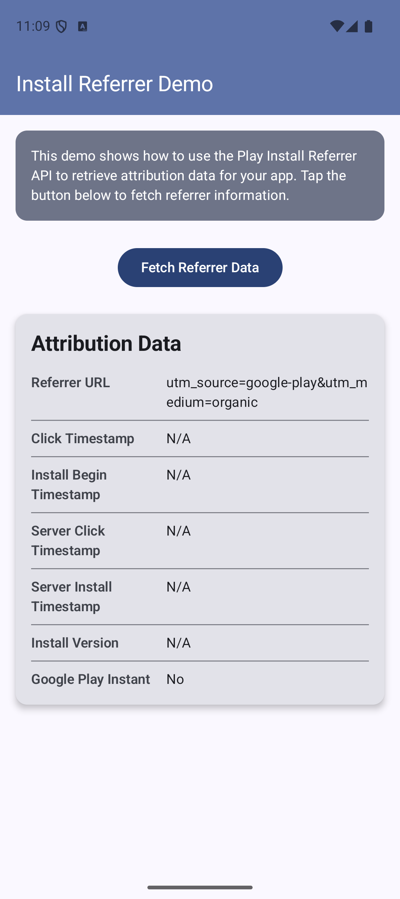

# InstallReferrerDemo

A sample Android app demonstrating the [Play Install Referrer API](https://developer.android.com/google/play/installreferrer) for tracking app attribution data.

## Screenshot



## What It Does

This app shows how to retrieve attribution data when a user installs your app from the Play Store, including:

- Referrer URL (campaign tracking parameters)
- Click and install timestamps (client and server)
- Install version
- Google Play Instant flag

## Tech Stack

- **Kotlin**
- **Jetpack Compose** with Material 3
- **MVVM** architecture (ViewModel + StateFlow)
- **Coroutines** for async Install Referrer API calls
- **Install Referrer API** v2.2

## Project Structure

```
app/src/main/java/dev/anthropic/installreferrerdemo/
├── MainActivity.kt
├── data/
│   ├── ReferrerInfo.kt          # Data model
│   └── ReferrerRepository.kt   # API wrapper with coroutines
└── ui/
    ├── theme/Theme.kt           # Material 3 theming
    ├── screens/
    │   ├── ReferrerViewModel.kt # State management
    │   └── ReferrerScreen.kt    # Main screen
    └── components/
        └── ReferrerInfoCard.kt  # Attribution data card
```

## Getting Started

1. Clone the repo:
   ```bash
   git clone https://github.com/RandhirGupta/InstallReferrerDemo.git
   ```

2. Open in Android Studio

3. Run on a device or emulator (API 24+)

4. Tap **"Fetch Referrer Data"** to retrieve attribution info

## How It Works

The app uses `InstallReferrerClient` to connect to the Play Store and retrieve referrer data:

```kotlin
val referrerClient = InstallReferrerClient.newBuilder(context).build()
referrerClient.startConnection(object : InstallReferrerStateListener {
    override fun onInstallReferrerSetupFinished(responseCode: Int) {
        if (responseCode == InstallReferrerClient.InstallReferrerResponse.OK) {
            val response = referrerClient.installReferrer
            // Access: response.installReferrer, response.referrerClickTimestampSeconds, etc.
        }
    }
    // ...
})
```

## Testing

On an emulator, the API returns default values (`utm_source=google-play&utm_medium=organic`). For full testing with campaign parameters, upload to the Play Console's internal testing track and install via a referrer link.

## Article

This project accompanies the article: **[Understanding Attribution for Mobile Apps: Pre-installed and Play Store Downloads](ARTICLE.md)**

## License

MIT
